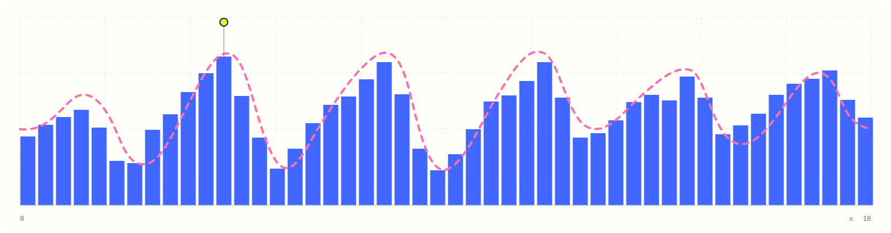

# MCMC Playground

好きな確率分布をキャンバスに描き、Metropolis-Hastings・HMC・NUTSでサンプリングして、得られたヒストグラムを見比べるためのサイトです。

## 使う

[MCMC Playground](https://106-.github.io/metropolis-hastings-playground/)

## 操作

- 上段左のグラフをドラッグして目標分布を変更
- 手描き分布と、HMC/NUTSが使う滑らかなフィットを比較
- `MH`・`HMC`・`NUTS`からサンプラーを選択
- MHの提案幅、HMCの積分幅と軌道長、NUTSの積分幅と最大深度を調整
- 「サンプリング開始」で実行、`+1` で1ステップ、`↺` で結果だけリセット
- 「一様」「ふた山」「かたより」からプリセットを選択

分布は未正規化の相対的な高さとして扱います。MHは手描き分布を直接使い、HMC/NUTSはガウシアン平滑化した分布とその勾配を使います。HMC/NUTSではロジスティック変換によって区間`0〜10`を扱い、すべての方式で最初の100ステップをバーンインとして除外します。
